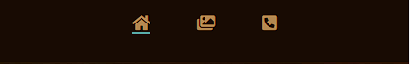
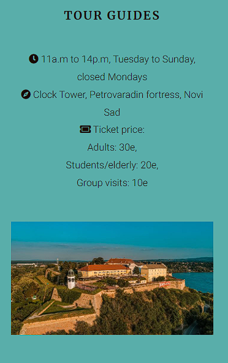
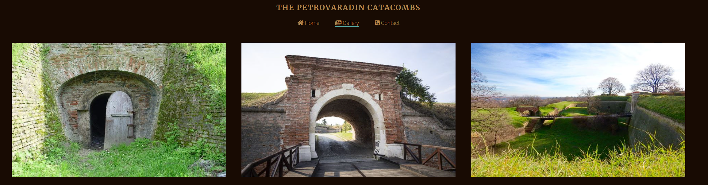
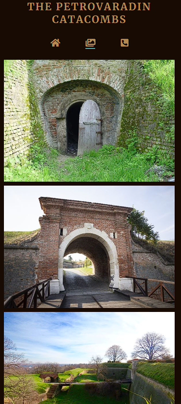
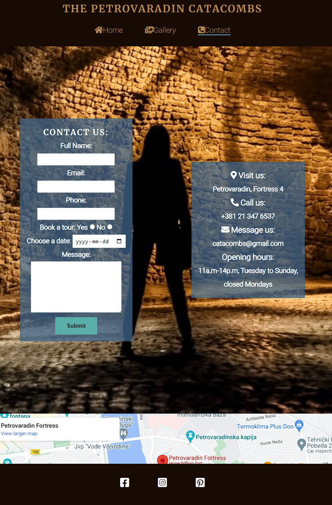
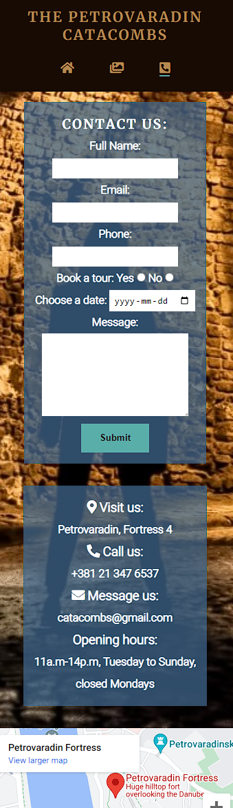

# The Petrovaradin Catacombs

The Petrovaradin Catacombs is a website that aims to provide information about organized tours through the underground of the fortress and to inspire visitors to be adventurous. 
The site will be targeted towards people who like to explore. The Petrovaradin catacombs will be useful for visitors to know where and when the tours take place. 

Visit the deployed site: [The Petrovaradin Catacombs](https://natasamiric.github.io/the-petrovaradin-catacombs/)

## Contents

* [User Stories](#User-Stories)

* [Design](#Design)
  * [Colour Scheme](#Colour-Scheme)
  * [Typography](#Typography)  
  * [Wireframes](#Wireframes)

* [Features](#Features)
  * [Existing features](#existing-features)
  * [Future Implementations](#futute-implementations)
  * [Accessibility](#Accessibility)

* [Technologies Used](#Technologies-Used)
  * [Languages Used](#Languages-Used)
  * [Frameworks, Libraries & Programs Used](#Frameworks,-Libraries-&-Programs-Used) 

* [Testing](#Testing)
  * [Validator Testing](#Validator-Testing)
  * [Unfixed Bugs](#Unfixed-Bugs)
    
 * [Deployment](#Deployment)

* [Credits](#Credits)
  * [Code Used](#Code-Used)
  * [Content](#Content)
  * [Media](#Media)
  * [Acknowledgments](#Acknowledgements)

---

## User Stories

* As a visiting user, I would like to gain some information about fortress.   
* As a visiting user, I would like to find out when and where are guiding tours taking place. 
* As a visiting user, I would like to be able to make a contact for business enquires and book a tour. 
* As a visiting user, I would like to receive confirmation that my query was sent successfully.
    
## Design
### Colour Scheme

The colors are chosen based on the most present colors on the images that are used throughout the website. The colour palette was created using the [Colormind](http://colormind.io/) website.

### Typography

[Google Fonts](https://fonts.google.com/) was used for the following fonts:

* Merriweather is used for headings on the site. It is a serif font.
* Roboto is used for the body text on the site. It is a sans-serif font. 

### Wireframes

Wireframes were created for desktop and mobile. 

[Desktop Wireframe](docs/wireframes/desktopwireframe.png)

[Mobile Wireframe](docs/wireframes/mobilewireframe.png)

## Features

### Existing features
 
**Logo**

  * It is featured on all three pages on website and fully responsive. It allow users to go back to home page by clicking on it. 

  

**Navigation bar**

  * It is featured on all three pages on website, fully responsive and it includes links to Home page, Gallery and Contact page.  
  * Fixed on top of all three pages to allow the user to easily navigate from page to page across all devices without having to revert back to the previous page via back button or scroll all the way up.
  * Sorted out according to priority and it is consistent in style and color in order to enable easy navigation.
  * In order to fit in one row, navigation links are presented with icons only on smaller screen sizes while on larger screens there is icon and text. 

  

  

**The Landing Page Image**

  * One third of the home page consist of the image that provides users with an insight how the catacombs look like and has an overlay text with information where the tour guides are located and slogan to inspire the users to use tour guide services. 

  
   
**About Section**

  * About section will allow users to find out some informations about the fortress and it's underground tunnels.
  * It consist of two boxes with the text that are responsive. On large screen sizes boxes are positioned horizontally and on smaller screen sizes vertically. 

  

  

**Tour Guide Section**

  * This section will allow users to see where and when the tour guides take place, information about the price and it has an image that shows the whole fortress which will arouse the interest of user with its appearance.
  * This section is fully responsive, one box containing the text and the other image. On smaller screens they are positioned on top of each other and on larger screen beside one another. 

  

  

**The Footer**

  * The footer section includes links to the relevant social media sites. The links will open to a new tab to allow easy navigation for the user.
  * The footer is valuable to the user as it encourages them to keep connected via social media where they can be constantly updated.

  

**Gallery page**

  * The gallery will give users the opportunity to see what the underground tunnels look like. 
  * This section is important because it will attract the attention of the users and motivate them to use the tour guide services. 

  
  

**Contact page**

  * This page will allow the user to contact The Petrovaradin Catacombs, book a tour and find out the informations about it's adress, phone number, email and opening hours. 
  * The user will be asked to submit their full name, email address, phone, to choose if they want to book a tour, choose a date, write a message. After submiting the form, users will recieve confirmation message that submission is done succesfully.   
  * Responsive form and contact information are positioned separately in two boxes and are overlaying the image that is covering the whole page and below is a map that show location of fortress. On larger screen sizes boxes are positioned horizontaly and on small screens verticaly. 

  
  

**Confirmation page**

  * Users will be redirected to the page after they fill out the form and submit it. 
  * It is valuable to the user to get the confirmation that his query is received. 

    

### Future Implementations

* Add review option
* Add video content
* Expand content 

### Accessibility

When creating this website, I paid great attention to its accessibility:

* The site consists of three separate pages in order to avoid excessive scrolling down the page and in the same time it's easier to access to relevant informations. It is also practical if in the future content expands. 
* Image content includes proper textual alternatives so that they can be understood by assistive technologies and their users.
* Site has a sufficient colour contrast and fonts that are easy to read. 

## Technologies Used

### Languages Used

HTML and CSS were used to create this website.

### Programs Used

Balsamiq- was used to create wireframes.

Github- was used store the project and display on GitHub Pages.

Git -was used for version control.

Google Fonts - was used to import the fonts used on the website.

Font Awesome - was used for the icons used on the website.

Google Dev Tools - to troubleshoot and test features, solve issues with responsiveness and styling.

Tiny PNG- was used to compress images.

Am I Responsive? - was used to show the website image on a range of devices.

[Adobe Color](https://color.adobe.com/create/color-contrast-analyzer) - for checking the contrast ratio between text and background color.

## Testing

Please see [testing.md](TESTING.md) for all testing performed.

## Deployment

* via gitpod
  * Log into GitHub.
  * Make a repository
  * Click the green button close to the top of the page that  says Gitpod.
  * After letting Gitpod load an alert pops up on the top of the screen, click cancel.
  * Then click the button that says More Actions.
  * Hereafter click Open in Browser.
  * Now right click with your mouse over the big box on the left that has your repository name over it.
  * Click new file.
  * Then make an index.html file.
  * Go to the top of the index file and click ! and enter. This will make a start template.
  * Make a basic structure for your index page.
  * Click on terminal at the bottom of the page.
  * Write 'git add .'
  * Then for your first commit write 'git commit -m "Initial commit".
  * Hereafter write 'git push'.
  * Your code have now been pushed back and saved on your GitHub repository.

  The live link can be found here: https://natasamiric.github.io/the-petrovaradin-catacombs/

* via GitHub pages
  * Log into GitHub.
  * Go to the repositories.
  * Then take this project LunationDesign.
  * Go to the settings link.
  * Then click on the pages link that is found on the navigations bar on the left side.
  * Check the source section on the page, and choose main instead of none.
  * Then click Save. After a few minutes you can see your live GitHub pages site is now deployed and the URL shown at the top of the page.

## Credits

### Code Used

* Header and footer were created using solutions from [Love Running project](https://github.com/Code-Institute-Solutions/Love-Running-Solutions). 

* [Kewin Powell](https://www.youtube.com/watch?v=u044iM9xsWU&t=194s) tutorials were used for learning and understanding of flexbox and background images.  

### Content

* Content from the website was taken from [Viator](https://www.viator.com/Belgrade-attractions/Petrovaradin-Fortress/d22817-a24438?mcid=28353&tsem=true&supci=-804742770&supag=50556324189&supsc=kwd-336495613121&supai=275935289408&supap=&supdv=c&supnt=g&supti=kwd-336495613121&suplp=1012212&supli=21213&m=28353&supag=50556324189&supsc=kwd-336495613121&supai=275935289408&supap=&supdv=c&supnt=nt%3Ag&suplp=1012212&supli=21213&supti=kwd-336495613121&tsem=true&supci=kwd-336495613121&supap1=&supap2=&gclid=Cj0KCQjwpeaYBhDXARIsAEzItbHDPdS4UMAAqpOsE34mK4aeH9zVAq6MDdV9DoweoVyIYS2qPRJmbYMaAqk9EALw_wcB) and [Atlas Obscura](https://www.atlasobscura.com/places/catacombs-of-petrovaradin-fortress).

###  Media  

The photos were taken from: 
* [Atlas Obscura](https://www.atlasobscura.com/places/catacombs-of-petrovaradin-fortress)
* [Unsplash](https://unsplash.com/photos/8d6DMAn1UDc)
* [Serbian Adventures](https://serbianadventures.com/en/adventure/view/622/underground-tour-adventure-catacombs)
* [Novi Sad Travel](https://novisad.travel/cp/u-dubinama-petrovaradinske-tvrdave/)
* [Trip Advisor](https://www.tripadvisor.com/LocationPhotoDirectLink-g295380-d11844462-i323718738-Petrovaradin_Catacombs-Novi_Sad_Vojvodina.html)
* [Exit festival](https://www.exitfest.org/petrovaradinska-tvrdava)
* [Wikipedia](https://sr.wikipedia.org/wiki/%D0%9F%D0%B5%D1%82%D1%80%D0%BE%D0%B2%D0%B0%D1%80%D0%B0%D0%B4%D0%B8%D0%BD%D1%81%D0%BA%D0%B0_%D1%82%D0%B2%D1%80%D1%92%D0%B0%D0%B2%D0%B0)
* [Itinari](https://www.itinari.com/what-petrovaradin-fortress-hides-underground-us8i)
* [In A City Near You](https://inacitynearyou.net/novi-sad-and-petrovaradin-fortress/)

###  Acknowledgments

I would like to thank the following people: 

* My mentor Rohit Sharma who guided me throughout the creation of the project.
* Ed Bradley who provided me with some great advices.
* My fellow students who took a time to review my code: Jacob Welsh, Niclas Tanskanen, Roger Pfäffli, Callum Dennis, Gary Gant and Hash. 
* Gary Gant who helped me with advice to add text shadow for the text on hero image. 
* [Kera Cudmore](https://github.com/kera-cudmore) whos Readme guide was a great help https://github.com/kera-cudmore/readme-examples/blob/main/milestone1-readme.md#Testing-User-Stories 

