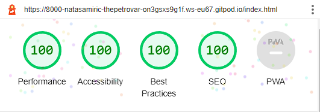
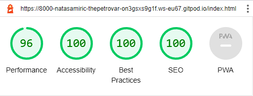
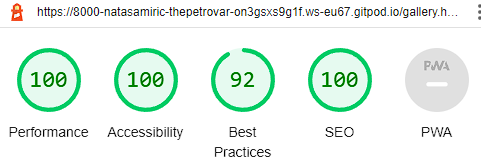
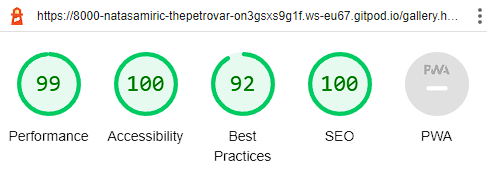
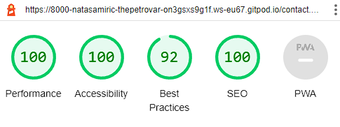
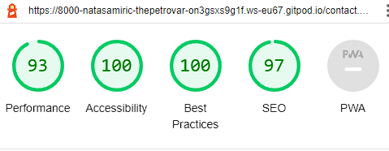
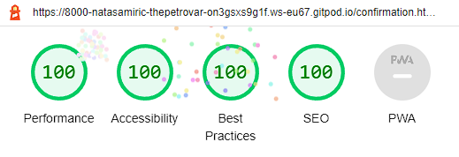
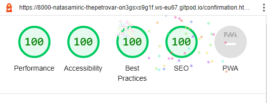
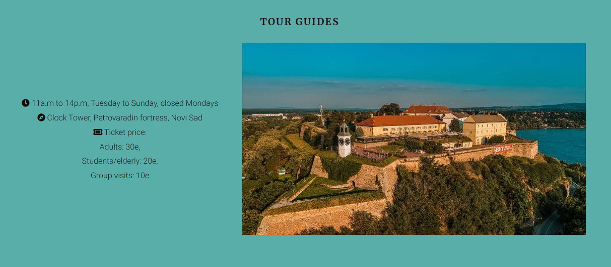

Testing was conducted throughout the website development with the help of Dev Tools. All the internal and external links and form have been checked if they are working correctly. External links are opening out in a new tab as they should and internal links lead to the intended destination. 

Testing of form was carried out with trying out different variations:

1. Trying to submit form without filling out any field. Form feedback indicated that name field should be filled out. 
2. After filling the name and clicked on submit, popped out the message that email should be filled out.
3. When filling out the email field with random data comes out warning that the field must include sign "@". 
4. When filling out the right email information, and trying to submit,comes out the warning to fill out the phone number.
6. When entering letters and sign in phone field, it returns warning to input numbers.
7. After name, email and phone number is filled out it comes back that radio buttons must been selected.
8. After all of the above is appropriately filled and clicked on submit, it comes warning that message must be written.
9. When all is selected and filled except date, the form would be succesfully sent and it would redirect to confirmation page.
10. Testing included all possible variations and each time form has reacted appropriately, that one of the fields should be filled out or button to be chosen. 

**Supported screens and browsers**

The website has a responsive layout and supports:  
* 1920px wide and down 
* 1220px wide and down
* 768px wide and down
* 480px and down until 280px. 

The website has been checked on multiple browsers and mobile devices:

* Google Chrome
* Firefox
* Opera
* Microsoft Edge 
* Samsung Galaxy S10+
* Galaxy Fold
* Samsung Galaxy S8
* Samsung Galaxy S20 Ultra
* Iphone 5/6/7/8
* Iphone 12 Pro
* Ipad Pro

When requesting for peer code review on Slack, Code Institute chanel, I got one feedback from Hash who pointed out: 

* When filling out the form on mobile device, form fields get covered by footer

* Too much empty space on contact page on desktop device  

### Validator Testing

The [W3C validator](https://validator.w3.org/) was used to validate HTML and [Jigsaw](https://jigsaw.w3.org/css-validator/) to validate CSS.

* HTML

  [Home page](docs/testing/validator/w3c-index.html.png)

  [Gallery](docs/testing/validator/w3c-gallery.html.png)

  [Contact page](docs/testing/validator/w3c-contact.html.png)

  [Confirmation page](docs/testing/validator/w3c-confirmation.png)

* CSS

  [CSS](docs/testing/validator/w3c-css.png)

### Lighthouse

Lighthouse runs a barrage of tests against the page, and then generates a report on how well the page did. 

* Home page (desktop and mobile)

* Gallery page (desktop and mobile)

* Contact page (desktop and mobile)

* Confirmation page (desktop and mobile)

### Testing User Stories
* As a visiting user, I would like to gain some information about fortress

  * On Home page in About section user can gain more information about the fortress and underground tunnels.
  * When landing on the home page, user should scroll down until the About setion where the infomration will be presented.

  

* As a visiting user, I would like to find out when and where are guiding tours taking place.

  * Home page contains Tour guide section where the user can see time and location where the tours are happening, as well as price. 
  * When landing on the home page, user should scroll down until the Tour Guide setion where the infomration will be presented.

   

* As a visiting user, I would like to be able to make a contact for business enquires and book a tour.  

  * The Contact page contains a form where the user can input his name,email, phone, choose to book a tour, choose a date and write a message to The Petrovaradin Catacombs.
  * When landing on the home page, user should find in the navigation bar Contact page and click on it.It will redirect user to another page where he will find the form. In the form, user should fill out the name, email, phone, to choose if he wants to book a tour and write a message. If one of the required fields is not field out user will be notified to do it. After filling out all necessery fields,user should click on submit button.Thereafter, user will be redirected to the confirmation page which will inform user that his query is succesfully sent. 

  

* As a visiting user, I would like to receive confirmation that my query was sent successfully.

  * When clicking on submit button in the form after filling out the form on Contact page, user will be redirected to a confirmation page where will he receive a message that it is succesfully sent and that the respond will be sent as soon as posible. 

  

### Fixed Bugs

1. Images on Gallery page did not look good on larger screen devices so I set up the multiple media queries in order to achieve good resolution of images on a different screen sizes.
2. Contact page on larger screens was containing large empty space so I included also a map to fill out the space and that also required adjustment with the help of media queries in order to look good on different screen sizes. I expanded the width and height of the hero image and the map.  
3. Cover text on hero image on Home page was not visible enough so I put a shadow and bold attributes. 